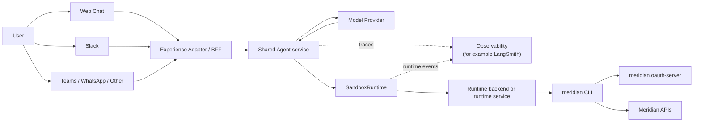

# Agent Runtime Vision

**Author**: Nicholas Hollas
**Date**: 2026-03-10
**Status**: Draft

## Purpose

This document records the forward-looking runtime questions that remain after the current shared system story has been consolidated into [`system-overview.md`](./system-overview.md).

It is narrower than the system overview. Its focus is the likely evolution from the current `meridian.chat`-hosted runtime to a more deliberately shared runtime model once Meridian has more than one real client channel.

## Context

The current runtime architecture is described in [`system-overview.md`](./system-overview.md). In summary:

- `meridian.chat` currently hosts the active web experience
- the repository contains an in-process `Agent service`
- the orchestration layer depends on `SandboxRuntime`
- `DockerRuntime` currently provides execution and per-session isolation
- the Meridian CLI remains the capability surface used by the agent

This current shape is workable because Meridian has one active client experience with one runtime implementation. The architecture already contains useful seams, but those seams are still hosted inside the web application repository.

## The Goal

The longer-term goal is to support more than one user-facing channel without forcing each channel to own its own orchestration loop, runtime lifecycle, or session model.

In that model, a user could send a message through web chat, Slack, Teams, or another interface, and a shared agent layer would respond using the `meridian` CLI inside a controlled runtime environment. The user would still authorise the session through device flow in a browser.

The architectural point remains the same as in the current system. The client channel carries the interaction, while the Meridian CLI continues to provide the capability surface.

## Why Extraction Is Not Required Yet

There is a reasonable temptation to extract the agent layer and runtime into their own service as soon as a future multi-channel shape becomes visible. In practice, that move only becomes worthwhile when it solves an operational problem the current structure can no longer absorb.

Right now, `meridian.chat` already separates:

- the web adapter
- the `Agent service`
- the `SandboxRuntime` contract
- the `DockerRuntime` implementation

That is enough architectural separation for one active client surface. Extracting those parts immediately would likely introduce another deployable unit before there is a clear operational need for one.

## Signals That Favour Extraction

Extraction becomes more compelling when one or more of the following become true:

- Meridian has more than one real client or channel that needs the same orchestration and runtime behaviour
- the orchestration layer needs to scale independently from the web application
- runtime lifecycle, security policy, or observability become operational concerns in their own right
- session management needs to be shared across several consuming applications
- the execution backend stops being a local web-app concern and becomes a platform concern

These signals are practical rather than ideological. The decision should be based on whether a separate service reduces real complexity for the system that exists at that point.

## Target Shape

If extraction becomes worthwhile, the likely target shape is:

- client or channel adapters for web chat, Slack, Teams, WhatsApp, or other interfaces
- a shared `Agent service` responsible for orchestration
- a stable runtime contract such as `SandboxRuntime`
- a runtime backend or runtime service that owns session lifecycle and execution
- per-session container-backed isolation, or a stronger equivalent where required
- centralised observability for model activity and runtime execution

## Target Diagram

## Key Design Constraints

The long-term runtime should preserve a small number of clear architectural properties.

### Per-session isolation

The runtime must provide an execution boundary per user session so that local auth and comparison state are not shared between unrelated sessions.

### Runtime abstraction

Experience adapters and the shared agent layer should depend on a runtime contract, not on Docker, a local process runner, or any single backend implementation.

### Shared agent orchestration

The system should not require each client channel to implement its own model loop, tool loop, or runtime integration logic. That orchestration should live in a shared `Agent service`.

### Discovery-first or hybrid capability exposure

The runtime should describe what is installed and how it should be used. The shared agent layer should not become tightly bound to one Meridian-specific capability set if the broader direction is to support other runtime profiles later.

### Explicit authorisation boundary

The user should authenticate in a browser through device flow. The runtime should act with resulting tokens only after the user has explicitly authorised the session.

### Auditability

The system should make it possible to inspect what commands were run, what state they operated on, and which user session they were associated with.

## Open Questions

Several important questions still need active design work:

1. **Session isolation.** Does each user get their own long-lived environment, or should later backends favour ephemeral execution plus persisted session state?
2. **Authorisation lifecycle.** How long should an authenticated session persist before the user needs to authorise again?
3. **Multi-channel support.** Which adapter model best supports Slack, Teams, web chat, and future clients without duplicating orchestration logic?
4. **Security and permissions.** What execution limits, resource limits, and trust boundaries are sufficient once the runtime is no longer local-only?
5. **Cost and scaling.** How should the runtime balance responsiveness, warm capacity, and per-session isolation cost?
6. **Observability.** What model and runtime telemetry is needed so command execution remains auditable and debuggable?
7. **Runtime ownership.** At what point should execution move out of `meridian.chat` and behind a dedicated runtime service?

## Relationship To Other Documents

Use [`system-overview.md`](./system-overview.md) for the current shared system story, including the current runtime architecture.

Use [`agent-runtime-roadmap.md`](./agent-runtime-roadmap.md) for the recommended order of implementation and the current phased plan.

Use these documents for adjacent concerns:

- [`system-overview.md`](./system-overview.md): high-level Meridian system context, current runtime shape, and repository roles
- [`agent-runtime-roadmap.md`](./agent-runtime-roadmap.md): phased runtime capability roadmap and persistence trade-offs
- [`kdds/KDD-001-runtime-backend-and-session-model-options.md`](./kdds/KDD-001-runtime-backend-and-session-model-options.md): option analysis behind the current runtime direction

Use repo-local documents for implementation and behaviour:

- `meridian.chat/docs/docker-runtime-setup.md`
- `meridian.cli/docs/cli-reference.md`
- `meridian.cli/docs/proof-of-concept.md`
