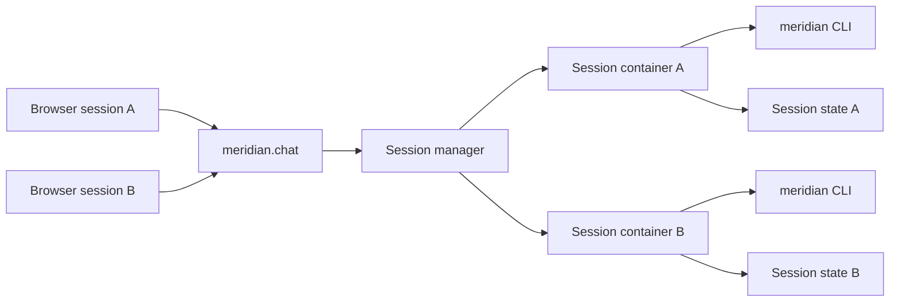

# KDD-001: Runtime Backend And Session Model Options

| Field | Value |
| --- | --- |
| **Status** | Accepted |
| **Date** | 2026-03-10 |
| **Author** | Nicholas Hollas |

## Problem

Meridian needed a current runtime shape that would allow multi-user chat sessions, keep user state isolated, run the Meridian CLI inside a sandbox rather than on the host machine, and still be practical to demonstrate locally on macOS.

The difficulty was not a single binary choice such as “use Docker or not”. The design space had four linked decisions:

1. the execution boundary
2. the session state model
3. the lifecycle model
4. the capability exposure model

Collapsing all of that into a single implementation decision would have made the first working version look more settled than it really was.

## Context

- `meridian.chat` originally executed CLI commands through Node.js `child_process` on the host machine
- there was no session concept, so all users shared one `~/.meridian` directory and one set of credentials
- `meridian.agent-sandbox` proved that the CLI worked in a Docker container with an agent, but it was a standalone prototype rather than an integrated runtime
- the runtime direction described in `meridian.docs/docs/agent-runtime-vision.md` requires a deployment shape that can later support multiple clients and channels
- the CLI runtime already supported an injected home directory, so per-session auth and data isolation were possible even without containers as an intermediate step

## What Needed To Be Decided

This exploration covered four related questions.

### 1. Execution boundary

Where should CLI commands run?

- host process
- long-lived container
- ephemeral command container
- dedicated runtime service
- microVM

### 2. Session state model

Where should runtime state live?

- container writable layer
- named Docker volume
- host directory per session

### 3. Lifecycle model

How long should a session environment live?

- warm for the active session
- retained with TTL expiry
- pooled and reused

### 4. Capability exposure model

How should the agent discover and use runtime capabilities?

- capability-specific tools
- generic runtime access plus instructions
- a hybrid model with generic access plus capability hints

## Options Considered

### Capability Exposure Models

#### 1. Capability-specific agent tools

The shared agent layer would expose explicit domain tools such as `auth_status` or `products_list`.

**Pros:**

- highly structured
- lower exploration cost
- easier to constrain tightly

**Cons:**

- couples the shared agent layer to one runtime profile
- makes it harder to support arbitrary future capabilities
- pushes runtime-specific concerns into shared agent code

#### 2. Discovery-first runtime access

The agent would receive generic runtime primitives such as command execution and file access, plus runtime-supplied instructions describing what is installed and how it should be used.

**Pros:**

- better matches a pluggable runtime direction
- lets the same agent architecture work across different capability sets
- keeps capability knowledge closer to the runtime

**Cons:**

- more exploration overhead
- potentially more tokens and latency
- harder to govern if the runtime is too open-ended

#### 3. Hybrid model

The runtime would provide generic access plus a concise capability manifest or hints.

**Pros:**

- preserves flexibility
- reduces blind exploration
- likely the best long-term balance

**Cons:**

- slightly more design work than either extreme

### Execution Boundary Options

#### 1. Host process with per-session state directories

Run the CLI on the host, but give each session its own home directory such as `/tmp/meridian-chat/<session-id>`.

**How it would work:**

- keep using a local process runner
- assign each session an isolated home directory
- either invoke the CLI as a library or spawn the binary with a session-specific `HOME`

**Pros:**

- fastest path to multi-session support
- no Docker socket or container orchestration
- very easy to debug locally

**Cons:**

- not a real sandbox
- does not satisfy the requirement that the CLI runs inside the sandbox
- continues to execute on the host machine

**Best fit:**

- a staged rollout if session semantics needed to be proved before true sandboxing

#### 2. Long-lived container per session

One active container per chat session, with commands executed through `docker exec`.

**Pros:**

- best alignment with the runtime vision
- natural isolation for auth and local state
- straightforward mental model: one conversation, one environment

**Cons:**

- idle containers are an expensive way to retain a small amount of state
- startup, cleanup, and health checking land inside `meridian.chat`
- mounting the Docker socket into the app is a major privilege escalation

**Best fit:**

- local demonstrations and early production-like experiments where showing real container execution matters now

#### 3. Ephemeral command containers with persistent session state

Create a short-lived container for each command, but keep `~/.meridian` in a named volume or mounted host session directory.

**How it would work:**

- the session manager creates a persistent state location per session
- each tool call runs `docker run --rm`
- the container exits after the command, but auth and data persist

**Pros:**

- cleaner cleanup model than idle containers
- better long-term shape for job-oriented execution
- avoids idle `sleep infinity` containers

**Cons:**

- `auth login --json` is intentionally long-lived, so device flow handling becomes less natural
- every command pays cold-start cost unless pooling is added
- interactive or streaming workflows are harder

**Best fit:**

- discrete, short commands where cleanup matters more than instant follow-up latency

#### 4. Dedicated runtime service

Move orchestration out of Next.js. `meridian.chat` would talk to a local or remote runtime service that owns session creation, command execution, and cleanup.

**Pros:**

- cleanest separation of concerns
- best path to multiple frontends beyond web chat
- easiest migration path to ECS, Kubernetes, or another remote backend

**Cons:**

- more moving parts up front
- slightly heavier local developer setup

**Best fit:**

- a medium-term direction once runtime orchestration becomes a product concern rather than a chat-app detail

#### 5. Firecracker microVMs

Still worth noting as a future production path, but not realistic for a local macOS-first implementation.

**Pros:**

- stronger isolation boundary

**Cons:**

- not suitable for local macOS demonstrations
- more operational complexity than was needed at this stage

**Best fit:**

- Linux-hosted production infrastructure serving less trusted users later

### Session State Model Options

Regardless of execution boundary, the CLI needed isolated storage for:

- `~/.meridian/credentials.json`
- `~/.meridian/data.json`
- temporary files used during command execution

#### 1. Container writable layer

Simple for a long-lived container, but state vanishes when the container does unless the environment is kept alive or snapshotted.

#### 2. Named Docker volume per session

Best fit for container-based runtimes. State remains independent from the lifetime of any one container instance.

#### 3. Host directory per session

Best fit as a bind-mount source for local containers, and still useful as a transitional state store if runtime state needs to be inspected outside the container layer during development.

### Lifecycle Options

#### 1. Session-scoped warm environment

Keep the environment alive while the user is active.

**Good for:**

- fast follow-up commands
- long-running auth polling

**Risk:**

- idle resource usage

#### 2. TTL-based persistence

Expire environments after inactivity, for example after 15 or 30 minutes.

**Good for:**

- balancing user experience and cleanup

**Risk:**

- slightly more bookkeeping

#### 3. Warm pool

Maintain a small number of pre-created environments for new sessions.

**Good for:**

- hiding startup latency if container creation is noticeable

**Risk:**

- extra complexity that may not be needed initially

## Decision

The current accepted direction is:

1. put a stable runtime abstraction in front of the execution backend
2. use Docker as the first real sandbox backend
3. keep session state outside the container writable layer, using a host-mounted session directory in the current local implementation
4. start with one warm container per active session, with cleanup handled separately
5. use a discovery-first or hybrid capability exposure model rather than hard-coded capability-specific agent tools

The most important decision is not “Docker or not”. The more durable decision is that the execution backend should remain swappable behind a runtime contract.

## Current Preferred Shape

The resulting current direction looks like this:



This was accepted because it balanced three needs at once:

- local demonstrability on macOS
- real session isolation
- a migration path towards a dedicated runtime service later

## Recommended Design Constraint

Even with Docker as the first backend, `meridian.chat` should call a runtime contract rather than hard-code container orchestration in the experience layer.

A minimal shape looked like this:

```ts
type SandboxSession = {
  id: string;
  stateLocation: string;
  lastUsedAt: Date;
};

interface SandboxRuntime {
  createSession(sessionId: string): Promise<SandboxSession>;
  runCommand(
    sessionId: string,
    argv: string[],
    options?: { stdin?: string; timeoutMs?: number },
  ): Promise<{ stdout: string; stderr: string; exitCode: number }>;
  destroySession(sessionId: string): Promise<void>;
}
```

That seam is what keeps the choice reversible.

## Implications

- `SandboxRuntime` becomes the architectural seam that matters most
- local development exercises the same container-backed execution model that the wider runtime direction expects
- session state is isolated per user session rather than shared through one host-level Meridian home
- the shared agent layer remains generic enough to work with runtime-supplied capabilities rather than a hard-coded Meridian tool list
- a dedicated runtime service remains a viable next step without invalidating the current local design

## Deferred Or Rejected Paths

### Host execution with per-session directories

This remained a credible intermediate step, but it was not chosen because it delayed real sandboxing and risked entrenching a backend the wider architecture did not want to keep.

### Ephemeral command containers as the first implementation

This remained attractive for cleanup and long-term job-oriented execution, but it was a poor first fit for long-running device flow commands and interactive follow-up work.

### Dedicated runtime service as the first implementation

This remained desirable architecturally, but it introduced more moving parts than were justified for the initial local stage.

### MicroVMs in the first implementation

This was deferred because it solved a later-stage isolation problem rather than the current local demonstrability problem.

## Open Questions

The accepted direction still left several questions open:

1. how quickly containers must start before a warm pool becomes necessary
2. what CPU and memory limits should apply per session
3. how many concurrent sessions the next stage needs to support
4. how long authenticated runtime state should persist across reloads and inactivity
5. whether Docker socket access is acceptable for the local-first stage or should be hidden behind a proxy or separate runtime process earlier
6. whether session state should remain host-mounted locally or move to another backing store in a later runtime
7. how early runtime orchestration should move out of `meridian.chat`

## Related Documents

- [`../agent-runtime-vision.md`](../agent-runtime-vision.md)
- [`../documentation-model.md`](../documentation-model.md)
