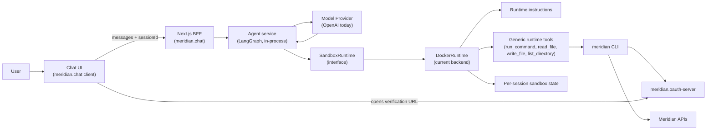
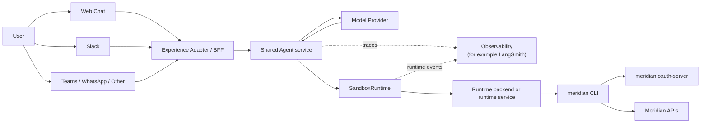

# Meridian System Overview

## Purpose

This document is the primary shared description of the Meridian system.

It explains what Meridian is, how the current repositories fit together, how the runtime works today, and where the architecture is likely to move next. Contributors should start here when they need a cross-repository view of the system.

Meridian remains a fairly small platform. It is a focused exploration of how Compare the Market's product comparison capability can be made available to an agent through a CLI-first runtime model, while keeping user authorisation explicit and auditable.

The number of repositories makes the work look larger than it is. In practice, the current system has a small set of moving parts:

- a CLI that exposes the comparison journey
- a web chat application that hosts the current multi-session agent experience
- a sandbox prototype that proved the CLI can run inside an isolated agent environment
- a non-production OAuth server that supports the CLI's device flow
- a documentation repository that explains how the parts fit together

## What Meridian Is

Meridian is an agent-driven comparison system built around a simple operational idea:

1. a user interacts with an agent through a client such as web chat
2. the agent runs inside a controlled runtime environment
3. the runtime has the `meridian` CLI installed
4. the CLI performs the comparison journey on the user's behalf
5. the user completes sign-in in a browser through OAuth 2.1 Device Flow rather than handing credentials to the agent

This keeps the capability surface close to tools that agents already understand well. It also preserves a clear trust boundary between user authorisation and runtime execution.

The communication channel carries the conversation, while the Meridian CLI remains the capability surface that actually performs the work.

## Current Repository Set

The Meridian workspace currently consists of five repositories.

### `meridian.cli`

`meridian.cli` owns the CLI proof of concept and the command surface that the agent uses.

It currently provides:

- authentication through OAuth 2.1 Device Flow
- product discovery
- Product Schema retrieval
- Proposal Request creation
- Proposal creation
- Result retrieval

This repository has the most mature local documentation set. Its documents already distinguish current behaviour, local rationale, ADRs, and KDDs.

### `meridian.chat`

`meridian.chat` owns the current web chat experience and the runtime integration used by that experience.

It currently provides:

- a browser chat UI
- a Next.js backend-for-frontend
- an in-process `Agent service`
- a `SandboxRuntime` abstraction
- a `DockerRuntime` implementation for local per-session isolation

This is the current home of the working runtime architecture for the web experience.

### `meridian.agent-sandbox`

`meridian.agent-sandbox` owns the sandbox prototype.

Its scope is intentionally narrow. It proves that the Meridian CLI can run inside a containerised agent environment with the expected tooling available. That learning informed the runtime work in `meridian.chat`, and this repository remains a prototype rather than the canonical home of the shared runtime architecture.

### `meridian.oauth-server`

`meridian.oauth-server` owns the non-production OAuth server based on Keycloak.

It provides:

- the Meridian issuer used by the CLI in non-production environments
- the `meridian-cli` client configuration
- seeded users for end-to-end development and demonstration

This repository owns issuer setup, deployment, and local operational detail. The wider runtime model is documented elsewhere.

### `meridian.docs`

`meridian.docs` owns the shared system documentation.

Its job is to describe the system across repository boundaries. It should stay small and selective. Repo-local setup, runbooks, and implementation detail should remain with the repository that owns the code.

## Current Runtime Story

Today, Meridian supports two closely related ways of using the same underlying capability.

The first is the CLI proof of concept in `meridian.cli`. In that model, an agent such as Codex or Claude Code runs locally alongside the user and executes the CLI directly.

The second is the local multi-session web prototype in `meridian.chat`. In that model, the user interacts through a browser UI, while the backend hosts the agent loop and executes the CLI inside a Docker-backed runtime on the user's behalf.

These two entry points share the same essential proposition. The agent uses the Meridian CLI as its capability surface, and the user authorises the session through device flow in a browser.

## Current End-To-End Flow

The current end-to-end experience is broadly as follows:

1. a user sends a message through the web chat UI, or works with an agent locally
2. the agent determines that it needs to use the Meridian CLI
3. if the session is not yet authorised, the agent starts the CLI login flow
4. the CLI returns a verification URL and user code
5. the user completes sign-in directly with the issuer in a browser
6. the CLI stores the resulting credentials in the session-specific Meridian home directory
7. the agent continues the comparison journey by calling further CLI commands
8. the user receives the resulting findings through the original client channel

The trust boundary matters here. The user authenticates directly with the issuer. The runtime receives tokens only after that authorisation succeeds for the relevant session.

## Current Runtime Architecture

The current web runtime architecture lives in `meridian.chat` and is built around a set of boundaries that are already useful beyond the web UI:

- `Chat UI` in the browser
- `Next.js` backend-for-frontend in `meridian.chat`
- `Agent service` as the orchestration layer
- `SandboxRuntime` as the execution contract
- `DockerRuntime` as the current implementation of that contract
- runtime instructions plus generic runtime tools exposed to the agent
- per-session sandbox state directories bind-mounted into Docker containers for authorisation and local data isolation

In plain English, the flow works like this:

- the UI sends chat messages and a `sessionId` to the backend
- the backend hosts the `Agent service` logic
- the `Agent service` currently runs an in-process `LangGraph` agent backed by OpenAI
- the `Agent service` uses generic runtime tools that operate through `SandboxRuntime`
- `SandboxRuntime` hides the execution backend from the orchestration layer
- `DockerRuntime` currently provides the execution backend and session isolation
- the runtime container has the Meridian CLI installed and uses `/sandbox-home` as the session-local home directory

The current repository split is therefore fairly disciplined. The web experience, orchestration layer, CLI capability surface, and issuer are separate concerns, even though the overall system is still small.

## Current Diagram

## Session And Authorisation Model

The current runtime is session-oriented.

Each browser session gets its own `sessionId`. In the local web implementation, that `sessionId` maps to isolated runtime state, including the Meridian home directory used for credentials and comparison data. Refreshing the same tab keeps the same session. Opening a fresh tab creates a new one. One browser session does not share authorisation state with another session.

Authentication uses Meridian's existing device flow:

1. the `Agent service` determines that authorisation is required
2. the `Agent service` runs the relevant CLI command through the runtime
3. the CLI returns the verification URL and user code
4. the backend streams that information back to the UI
5. the user completes sign-in in a browser against `meridian.oauth-server`
6. the CLI finishes polling and writes credentials into the session-specific Meridian home directory

This session model is one of the important reasons the current architecture already has value. The move from host execution to an isolated runtime was not simply an implementation detail. It established a usable execution boundary for per-session state.

## Why The Current Separation Is Reasonable

The current repository split is more deliberate than it might first appear.

`meridian.cli` owns the comparison capability surface. `meridian.chat` owns the current user-facing web experience and the runtime integration needed for that experience. `meridian.oauth-server` owns the issuer required to exercise the authorisation flow in non-production environments. `meridian.agent-sandbox` captures a narrow piece of runtime prototyping work. `meridian.docs` explains how the whole system fits together.

That is a sensible division for the current stage of the work. The boundaries are already strict enough that the next structural move, if and when it becomes necessary, should be an extraction rather than a redesign.

## Likely Next Structural Change

The most plausible future change is to move the shared orchestration and runtime concerns out of `meridian.chat` and into a dedicated service.

For the current stage of the work, that can wait.

At the moment, `meridian.chat` contains a workable separation between:

- the web adapter
- the `Agent service`
- the runtime contract
- the current Docker-backed runtime implementation

That is enough structure for one active client channel.

Extraction becomes more compelling when one or more of these conditions are true:

- Meridian has more than one real client or channel, such as web chat plus Slack or Teams
- the orchestration layer needs to scale independently from the web application
- runtime lifecycle, security policy, or observability become concerns in their own right
- multiple consumers need the same shared session and execution model

When that happens, the likely target shape is:

- thin client or channel adapters for web chat, Slack, Teams, WhatsApp, or other interfaces
- a shared `Agent service` responsible for orchestration
- a stable runtime contract such as `SandboxRuntime`
- a runtime backend or runtime service that owns session lifecycle and execution
- per-session container-backed isolation, or a stronger equivalent where required
- centralised observability for model activity and runtime execution

## Future Direction Diagram

## Open Design Questions

Several questions still need active design work:

1. **Session isolation.** Does each user need a long-lived environment, or should later backends favour ephemeral execution plus persisted session state?
2. **Authorisation lifecycle.** How long should an authenticated session persist before the user needs to authorise again?
3. **Multi-channel support.** Which adapter model best supports web chat, Slack, Teams, and future clients without duplicating orchestration logic?
4. **Security and permissions.** What execution limits, resource limits, and trust boundaries are sufficient once the runtime is no longer local-only?
5. **Cost and scaling.** How should the runtime balance responsiveness, warm capacity, and the cost of per-session isolation?
6. **Observability.** What model and runtime telemetry is needed so command execution remains auditable and debuggable?
7. **Runtime ownership.** At what point should execution move out of `meridian.chat` and behind a dedicated service?

## Documentation Model

The shared documentation should stay simple.

The practical model is:

- this document is the primary cross-repository overview
- each implementation repository owns its own setup, reference, runbook, and implementation detail
- cross-cutting ADRs and KDDs should stay rare and should exist only when a decision genuinely constrains multiple repositories

That means:

- `meridian.cli` should continue to own the CLI reference, local setup, and CLI-specific decision records
- `meridian.chat` should own the current web application and local runtime setup material
- `meridian.oauth-server` should own issuer setup and operational guidance
- `meridian.agent-sandbox` should remain lightweight and primarily README-driven
- `meridian.docs` should explain how the parts fit together, not restate each repository's local detail

## Related Documents

Use these documents for adjacent concerns:

- [`documentation-model.md`](./documentation-model.md): document placement rules and maintenance guidance
- [`agent-runtime-vision.md`](./agent-runtime-vision.md): forward-looking notes on when a dedicated shared runtime service becomes worthwhile

Use repo-local documents for implementation and behaviour:

- `meridian.cli/docs/cli-reference.md`
- `meridian.cli/docs/proof-of-concept.md`
- `meridian.chat/docs/docker-runtime-setup.md`
- `meridian.oauth-server/runbook.md`
